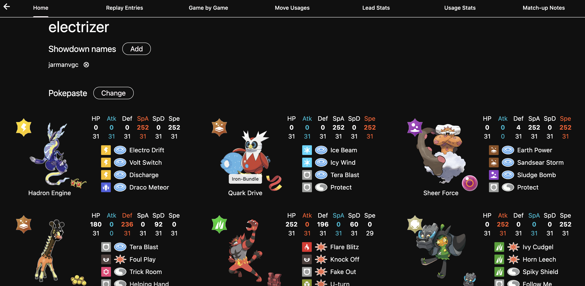
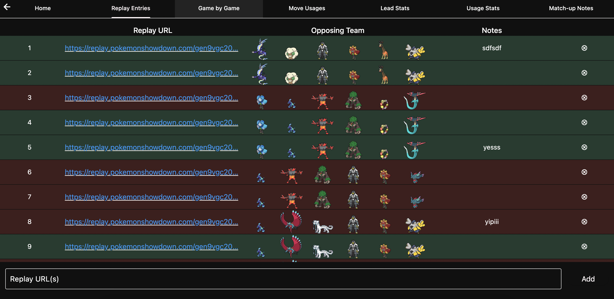
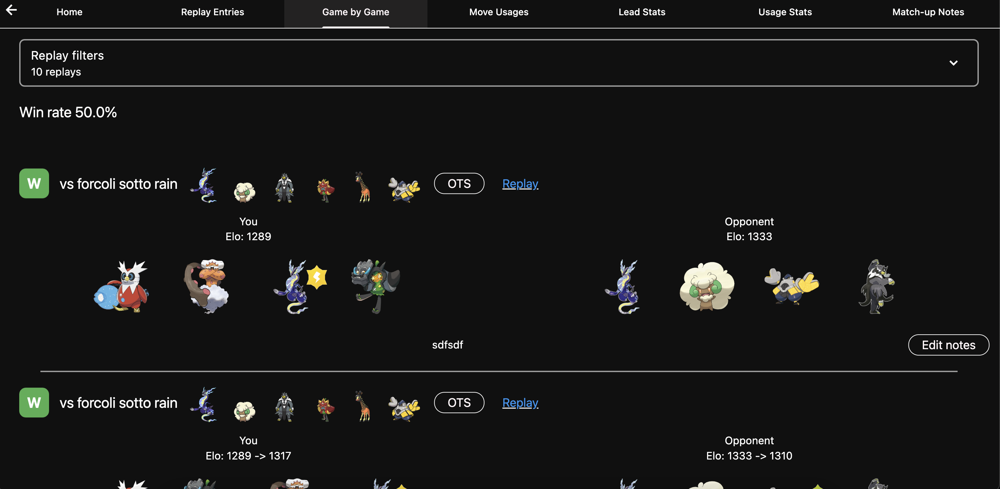
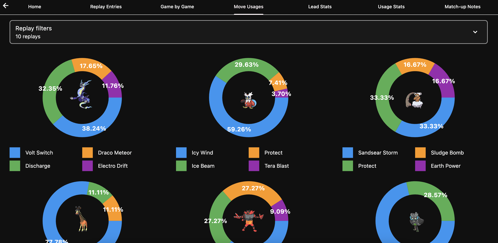
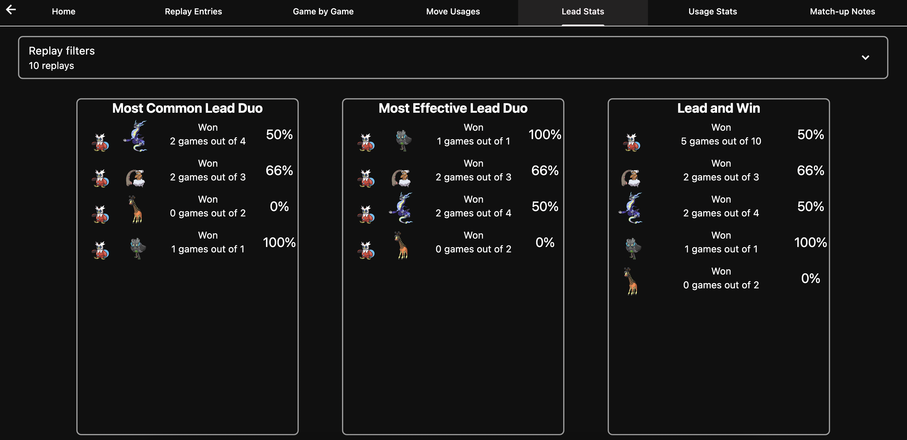
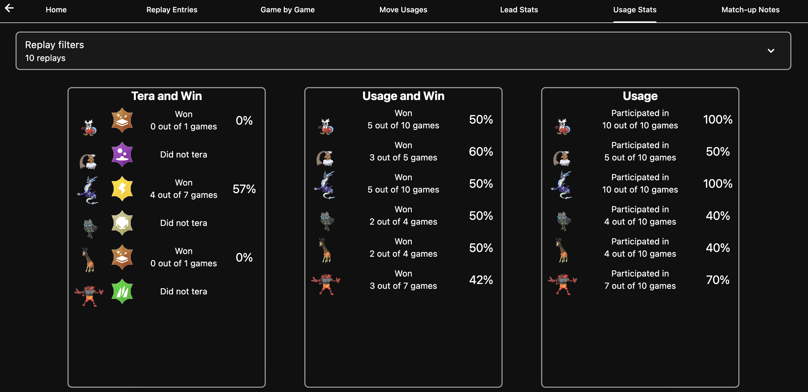
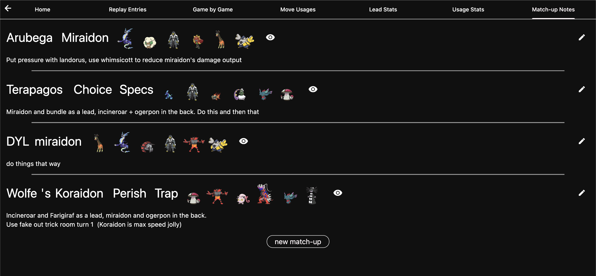

# Poke Show Stats

Poke Show Stats is a project that fetches Pokemon Showdown replays and display insights about
the battles. This app can be used to see how well a player performs with a team, and take notes
to improve on using this team.

Visit the website [here](https://tambapps.github.io/poke-show-stats/).

Or download the Android app [here](https://play.google.com/store/apps/details?id=com.tambapps.pokemon.showstats).

## Screenshots

### Desktop

### Mobile

  
   
  
  

